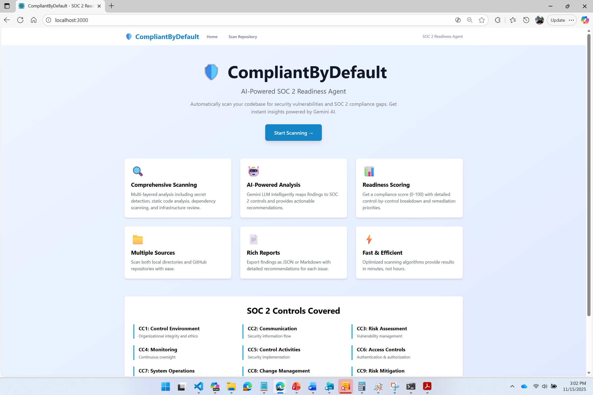
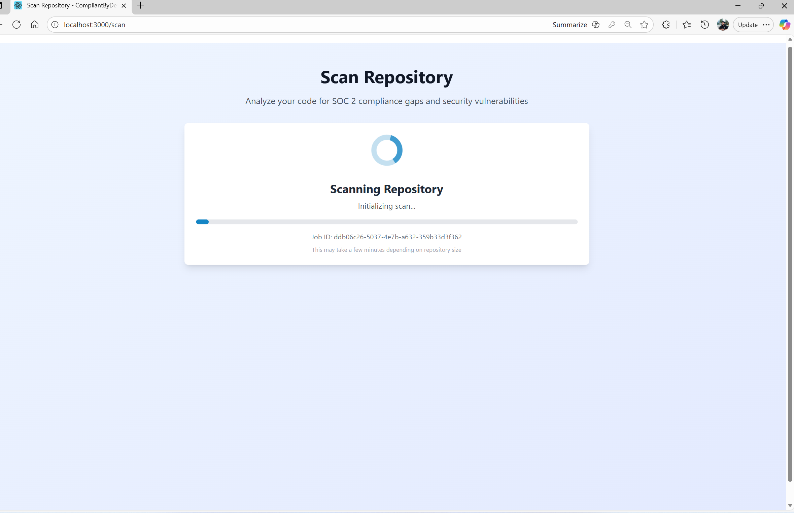
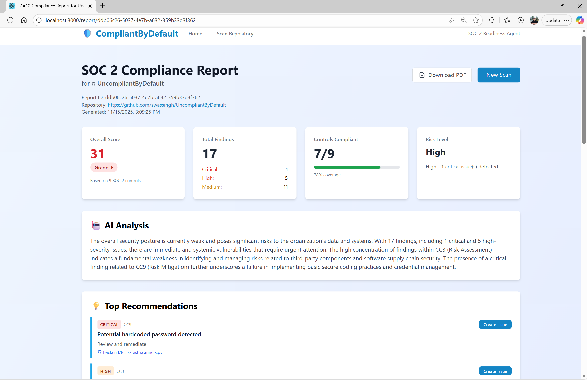

# 🛡️ CompliantByDefault

**AI-Powered SOC 2 Readiness Agent**

Automatically scan your codebase for security vulnerabilities and SOC 2 compliance gaps. Get instant, actionable insights powered by Google Gemini AI.


---

## 🎯 Overview

CompliantByDefault is a comprehensive compliance analysis tool that combines static code analysis, dependency scanning, and AI-powered insights to help organizations achieve SOC 2 readiness.

### Key Features

- 🔍 **Multi-Layer Scanning**: Secret detection, static analysis, dependency checks, and IaC security
- 🤖 **AI-Powered Analysis**: Gemini LLM intelligently maps findings to SOC 2 controls
- 📊 **Readiness Scoring**: Get a compliance score (0-100) with detailed breakdown
- 📁 **Flexible Sources**: Scan local directories or GitHub repositories
- 📄 **Rich Reports**: Export as JSON or Markdown with detailed recommendations
- 🌐 **Multiple Interfaces**: Web dashboard, REST API, or CLI tool

### What It Analyzes

- **Secrets**: Hardcoded API keys, passwords, tokens, private keys
- **Code Security**: SQL injection, weak crypto, insecure configurations
- **Dependencies**: Vulnerable packages, loose version constraints
- **Infrastructure**: Terraform, Docker, Kubernetes misconfigurations
- **Compliance**: Maps findings to SOC 2 Trust Service Criteria

---

## 🚀 Quick Start

### Prerequisites

- **Backend**: Python 3.9+, pip
- **Frontend**: Node.js 18+, npm/yarn
- **API Key**: Google Gemini API key ([Get one here](https://makersuite.google.com/app/apikey))

### Installation

1. **Clone the repository**
```bash
git clone https://github.com/yourusername/CompliantByDefault.git
cd CompliantByDefault
```

2. **Set up the backend**
```bash
cd backend
pip install -r requirements.txt

# Create .env file
echo "GEMINI_API_KEY=your_api_key_here" > .env
```

3. **Set up the frontend**
```bash
cd ../frontend
npm install

# Create .env.local file
echo "NEXT_PUBLIC_API_URL=http://localhost:8000" > .env.local
```

### Running the Application

**Terminal 1 - Backend:**
```bash
cd backend
python -m uvicorn src.api:app --reload --host 0.0.0.0 --port 8000
```

**Terminal 2 - Frontend:**
```bash
cd frontend
npm run dev
```

Open [http://localhost:3000](http://localhost:3000) in your browser.

---

## 📖 Usage

### Web Interface

1. Navigate to [http://localhost:3000](http://localhost:3000)
2. Click "Start Scanning"
3. Choose GitHub repository or local directory
4. View your compliance report with:
   - Overall readiness score
   - Severity breakdown
   - AI-generated insights
   - Detailed findings by control
   - Actionable recommendations

### CLI Tool

```bash
# Scan a local directory
python -m backend.src.cli scan-local /path/to/project

# Scan a GitHub repository
python -m backend.src.cli scan-github https://github.com/user/repo

# With GitHub token for private repos
python -m backend.src.cli scan-github https://github.com/user/repo -t ghp_token

# View a specific report
python -m backend.src.cli report <job-id>

# List all reports
python -m backend.src.cli list
```

### REST API

```bash
# Start a scan
curl -X POST http://localhost:8000/scan/github \
  -H "Content-Type: application/json" \
  -d '{"repo_url": "https://github.com/user/repo"}'

# Get report
curl http://localhost:8000/report/<job-id>

# List all reports
curl http://localhost:8000/reports
```

See [API Documentation](docs/api_spec.md) for complete endpoint reference.

---

## 🏗️ Architecture

```
┌─────────────────────────────────────────────────────────┐
│                  Frontend (Next.js)                      │
│              Web UI + API Client                         │
└────────────────────┬────────────────────────────────────┘
                     │ HTTP/REST
┌────────────────────▼────────────────────────────────────┐
│              Backend (FastAPI)                           │
│  ┌─────────────────────────────────────────────────┐   │
│  │         Scan Orchestration Engine               │   │
│  └────┬────────────┬────────────┬───────────┬──────┘   │
│       │            │            │           │           │
│  ┌────▼────┐  ┌───▼────┐  ┌───▼─────┐ ┌──▼──────┐    │
│  │ Secret  │  │ Static │  │  Deps   │ │   IaC   │    │
│  │ Scanner │  │Scanner │  │ Scanner │ │ Scanner │    │
│  └─────────┘  └────────┘  └─────────┘ └─────────┘    │
│         └──────────────┬──────────────┘                │
│                  ┌─────▼──────┐                        │
│                  │ LLM        │                        │
│                  │ Analyzer   │◄─────┐                 │
│                  └─────┬──────┘      │                 │
│                  ┌─────▼──────┐  ┌───▼────┐            │
│                  │ Scoring    │  │ Report │            │
│                  │ Engine     │  │  Gen   │            │
│                  └────────────┘  └────────┘            │
└─────────────────────────────────────────────────────────┘
                          │
                    ┌─────▼──────┐
                    │  Gemini    │
                    │    API     │
                    └────────────┘
```

See [Architecture Documentation](docs/architecture.md) for detailed design.

---

## 📦 Project Structure

```
CompliantByDefault/
├── backend/
│   ├── src/
│   │   ├── main.py                 # Orchestration engine
│   │   ├── api.py                  # FastAPI endpoints
│   │   ├── cli.py                  # CLI tool
│   │   ├── config/
│   │   │   └── soc2_controls.yaml  # Controls & patterns
│   │   ├── scanners/
│   │   │   ├── secret_scanner.py
│   │   │   ├── static_scanner.py
│   │   │   ├── dependency_scanner.py
│   │   │   └── iac_scanner.py
│   │   ├── analyzers/
│   │   │   ├── llm_analyzer.py     # Gemini integration
│   │   │   └── scoring.py
│   │   ├── integrations/
│   │   │   └── github_loader.py
│   │   ├── utils/
│   │   └── reports/
│   ├── tests/
│   ├── requirements.txt
│   └── README.md
├── frontend/
│   ├── src/
│   │   ├── pages/
│   │   │   ├── index.tsx           # Landing page
│   │   │   ├── scan.tsx            # Scan page
│   │   │   └── report/[id].tsx     # Report page
│   │   ├── components/
│   │   │   ├── Navbar.tsx
│   │   │   ├── RepoSelector.tsx
│   │   │   ├── ScanProgress.tsx
│   │   │   ├── ReportCard.tsx
│   │   │   └── FindingsTable.tsx
│   │   ├── lib/
│   │   │   └── api.ts              # API client
│   │   └── types/
│   │       └── index.ts            # TypeScript types
│   ├── package.json
│   ├── tsconfig.json
│   └── README.md
├── docs/
│   ├── architecture.md
│   ├── api_spec.md
│   └── frontend_design.md
└── README.md
```

---

## 🧪 Testing

### Backend Tests

```bash
cd backend
pytest                          # Run all tests
pytest --cov=src tests/        # With coverage
pytest tests/test_api.py       # Specific test file
```

### Frontend Tests

```bash
cd frontend
npm test                       # Run tests
npm run test:watch            # Watch mode
```

---

## 📊 SOC 2 Controls Covered

| Control | Name | Description |
|---------|------|-------------|
| **CC1** | Control Environment | Organizational integrity and ethics |
| **CC2** | Communication & Information | Security information flow |
| **CC3** | Risk Assessment | Vulnerability management |
| **CC4** | Monitoring Activities | Continuous oversight |
| **CC5** | Control Activities | Security implementation |
| **CC6** | Access Controls | Authentication & authorization |
| **CC7** | System Operations | Operational management |
| **CC8** | Change Management | Version control & code review |
| **CC9** | Risk Mitigation | Secrets management & encryption |

---

## 🔐 Security

This tool scans for security issues but is itself not hardened for production use without additional security measures:

- **API Keys**: Store in environment variables, never commit
- **GitHub Tokens**: Used only for cloning, not persisted
- **Reports**: Contains sensitive data, protect access
- **CORS**: Configure for your production domain

---

## 🛠️ Configuration

### Backend Environment Variables

```env
GEMINI_API_KEY=your_gemini_api_key_here
GITHUB_TOKEN=optional_github_token
```

### Frontend Environment Variables

```env
NEXT_PUBLIC_API_URL=http://localhost:8000
```

### Customizing SOC 2 Controls

Edit `backend/src/config/soc2_controls.yaml` to:
- Add new controls
- Modify security patterns
- Adjust severity weights
- Define custom checks

---

## 🚧 Limitations & Future Enhancements

### Current Limitations

- File-based report storage (no database)
- Single-server deployment
- Limited to pattern-based detection
- Manual trigger (no CI/CD integration)

### Planned Enhancements

- [ ] Database integration (PostgreSQL)
- [ ] CI/CD pipeline integration (GitHub Actions, GitLab CI)
- [ ] Scheduled scans
- [ ] Historical trend analysis
- [ ] Multi-tenant support
- [ ] Custom rule creation UI
- [ ] Webhook notifications
- [ ] PDF report export
- [ ] Team collaboration features
- [ ] SAML/SSO authentication

---

## 🤝 Contributing

Contributions are welcome! Please:

1. Fork the repository
2. Create a feature branch (`git checkout -b feature/amazing-feature`)
3. Commit your changes (`git commit -m 'Add amazing feature'`)
4. Push to the branch (`git push origin feature/amazing-feature`)
5. Open a Pull Request

### Development Guidelines

- Follow PEP 8 for Python code
- Use TypeScript for frontend code
- Add tests for new features
- Update documentation
- Run linters before committing

---

## 📄 License

This project is licensed under the MIT License - see the [LICENSE](LICENSE) file for details.

---

## 🙏 Acknowledgments

- **Google Gemini** for AI-powered analysis
- **FastAPI** for the excellent Python web framework
- **Next.js** for the React framework
- **Tailwind CSS** for styling
- SOC 2 Trust Service Criteria documentation

---

## 📞 Support

- **Documentation**: See `/docs` folder
- **Issues**: [GitHub Issues](https://github.com/yourusername/CompliantByDefault/issues)
- **Discussions**: [GitHub Discussions](https://github.com/yourusername/CompliantByDefault/discussions)

---

## 📸 Screenshots

### Landing Page


### Scan Progress


### Compliance Report


---

**Built with ❤️ for the Open Source AI Hackathon**

*Making SOC 2 compliance accessible to everyone*
